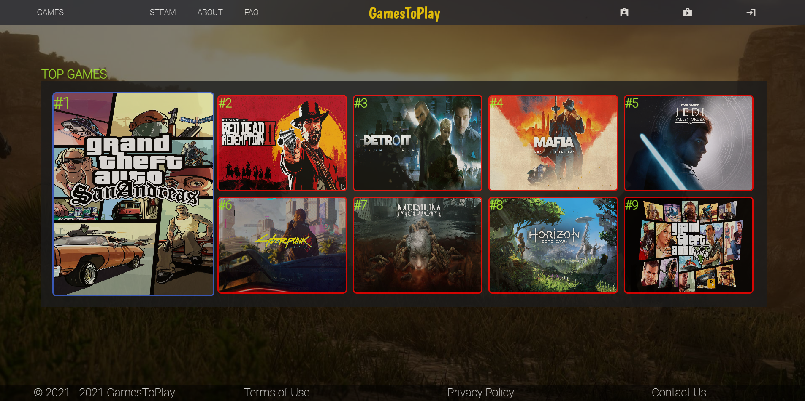
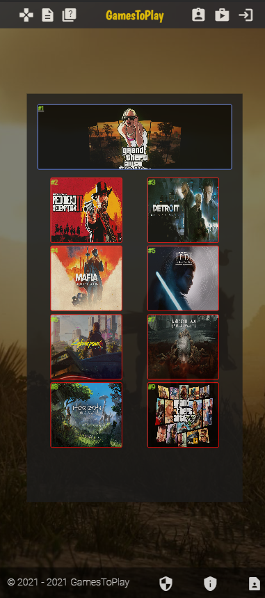

<h1>GamesToPlay - HTML5/PHP/JS/CSS/SQL Project</h1>
 
<h3>Features</h3>
<ul>
    <li>User Profile</li>
    <li>SignUp Functionality</li>
    <li>LogIn Functionality</li>
    <li>Mobile Responsive</li>
    <li>Multiple User Profiles</li>

</ul>

<h2>Acknowledgments</h2>

<b> HTML5: https://bit.ly/html5-certifications<b>
 
<b> JavaScript: https://bit.ly/javascript-certifications <b>
 
<b> CSS: https://bit.ly/css-certifications <b>
 
<b> Responsive Web Design: https://bit.ly/responsive-web-design-certifications <b>
 
<b> PHP: https://bit.ly/php-certificate <b>
 
<b> SQL: https://bit.ly/sql-certificatee <b>
 

<h2>Photos</h2>

Desktop Website

 
 

Mobile Website

 

<h2>Contact</h2>

<b> Email: mariusc0023@gmail.com </b>
